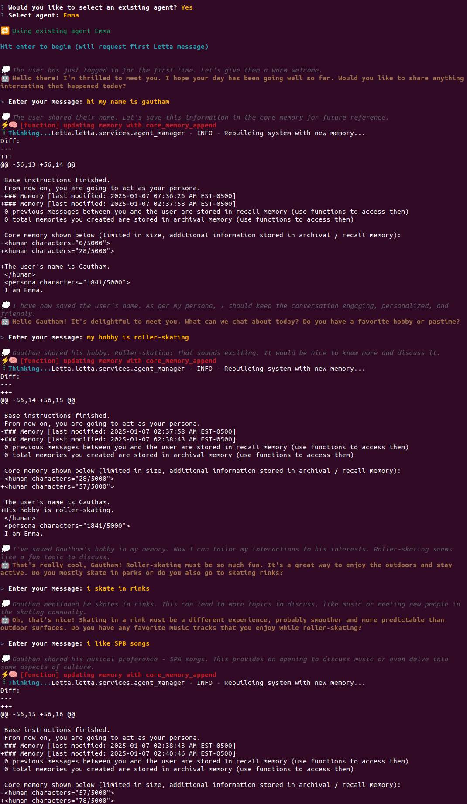

# 🤖 LLM Memory Toolkit

A stateful AI agent built on the Letta platform using Llama 3.1, featuring dynamic memory management and custom tool integration for enhanced conversational experiences.

<div align="center">

[](https://www.python.org/) [](https://ai.meta.com/blog/meta-llama-3-1/) [](https://ollama.com/https://ollama.com/) [](https://www.letta.com/)

</div>


## 📚 Table of Contents
- [Features](#features)
- [Project Structure](#project-structure)
- [Installation](#installation)
- [Configuration](#configuration)
- [Usage](#usage)
- [Example Conversations](#example-conversations)
- [Technical Details](#technical-details)
- [Contributing](#contributing)

## ✨ Features

- **Stateful Conversations**: Maintains context and memory across interactions
- **Local Model Hosting**: Uses Ollama for running Llama 3.1 locally
- **Custom Tool Integration**: Enhanced capabilities with specialized tools
- **Dynamic Learning**: Evolves through user interactions
- **Memory Management**: Sophisticated state handling and updates
- **Persona Customization**: Configurable agent personality and behavior

## 🗂️ Project Structure

```
llm-mem-toolkit/
├── LICENSE
├── Letta_system_persona    # System instructions and persona which was used
├── agentdetails.py         # Displays agents details
├── chat_agent.py           # sending user message to Chat bot
├── distance.py             # Distance calculation tool
├── get_agent_messages.py   # Displays chat history based on the agent id
├── location.py             # gets the location of the user
├── new_letta_listagents.py # Lists all the Agents in Letta Local server
└── weather_tool.py         # Weather information
```

# Installation and Configuration Guide

## 🚀 Installation

1. Install Letta:
```bash
pip install letta
```

2. Start the Letta server:
```bash
letta server
```

3. Open Letta interface:
   - Navigate to http://localhost:8283 in Google Chrome

## ⚙️ Configuration

### 1. Set up Letta and ADE
- Use the Letta interface to create and customize agents
- Start the server and navigate to ADE for agent development

### 2. System Persona
- Edit `Letta_system_persona` to configure the default behavior
- Adjust memory parameters as needed

### 3. Custom Tools
- Configure API keys for tools in the respective files
- Modify parameters as needed for custom requirements

### 4. Agent Interaction and Management

The following Python scripts are available for agent management:

- **agentdetails.py**
  - Displays details of the agents
  - Usage: `python agentdetails.py`

- **chat_agent.py**
  - Sends user messages to the chatbot
  - Usage: `python chat_agent.py`

- **get_agent_messages.py**
  - Fetches chat history based on agent ID
  - Usage: `python get_agent_messages.py`

- **new_letta_listagents.py**
  - Lists all agents running on the Letta local server
  - Usage: `python new_letta_listagents.py`


## 💬 Example Conversations

Here are some example interactions with the agent:




## 🤝 Contributing

1. Fork the repository
2. Create a feature branch (`git checkout -b feature/amazing-feature`)
3. Commit changes (`git commit -m 'Add amazing feature'`)
4. Push to branch (`git push origin feature/amazing-feature`)
5. Open a Pull Request

## ⚠️ Requirements

- Python 3.6+
- Letta Platform
- Ollama
- Llama 3.1 model
- Internet connection for tools

## 📄 License

This project is licensed under the included LICENSE file.

---
<div align="center">

Created by **Sethuram2003**

</div>
